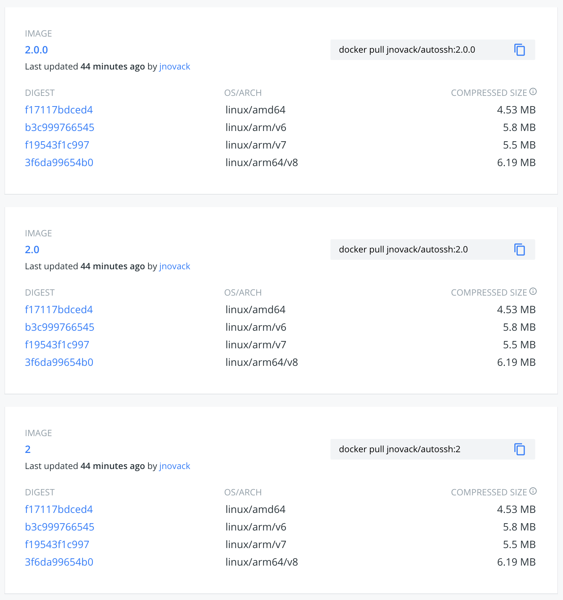

# Docker Hub Multi-Arch Hooks Template

The scripts in this respository are intended to provide auto-updating builds based on tags and automatic building of multi-arch images.

As the practice goes, pulling the tag `:1` of your container, should always pull the most up-to-date release in the `v1` version, be it `v1.3.1` or `v1.99.99`.  If you wanted `v1.0.0` specifically, best practices means you should grab `:1.0.0`. However, if a user always wants `v1.2` and all patches of `v1.2` (e.g. `v1.2.4`, `v1.2.219`), but never `v1.3`, the user MUST download `:1.2`. If someone always wants the latest version, they download `:latest`.

For best practices on Docker Hub, when you push a patch (`x.x.PATCH`) version of your container, you SHOULD be updating the major (`MAJOR.x.x`) and minor (`x.MINOR.x`) versions of your release to point to this new build.  Additionally, when pushing a new minor release, you SHOULD be updating the major container version.

When you tag and push `v1.2.3` of your repository, these scripts will create a new tag, `:1.2.3`, for your container.  It will also automatically update `:1.2` and `:1` for you to this build.  Keeping all releases up to date.

## Follow My Example

I used this template for my [jnovack/autossh](https://www.github.com/jnovack/autossh) repository, which has automatic builds on Docker Hub for my [jnovack/autossh](https://hub.docker.com/r/jnovack/autossh) image.

Because all of the architectures are in one image tag, you can `docker pull jnovack/autossh:2.1.3` from a raspberry pi 3 (`arm32v7` architecture), a raspberry pi zero (`arm32v6` architecture), an Amazon AWS instance (`arm64v8` architecture), or a linux or mac desktop (`amd64` architecture).  Each image will find the correct architecture to download, without having to specify different tags.  One tag, many architectures.

## How To Use

1. You MUST click "Use This Template" on Github.  DO NOT "Fork" a *template* repository.
2. You SHOULD update and synchronize all your `Dockerfile`s, adding all your commands at the end. Please update the label section.
3. You MUST tag and push your commits with [semantic versioning standards](https://semver.org).

### Tagging Your Commits

In order to use these scripts, you **MUST** tag your commits following [semantic version standards](https://semver.org).

The format is `vMAJOR.MINOR.PATCH` (please note the lowercase `v`).  Examples: `v0.0.4`, `v1.0.0`, `v2.0.103`.  Yes, I'm aware the `v` is not a part of semantic versioning, use it in the git tags; it will not show up on your images.

If you wish to use lightweight tags within git, it is recommended to push your tag **PRIOR** to pushing the commit so that Docker Hub does not label your build incorrectly.  Yes, there is a delay prior to Docker Hub building your release, however, you should not rely on it.

To properly version your releases (according to semver) increment the:

1. **MAJOR** version when you make incompatible API changes,
1. **MINOR** version when you add functionality in a backwards-compatible manner, and
1. **PATCH** version when you make backwards-compatible bug fixes.

Additional labels for pre-release and build metadata are available as extensions to the `MAJOR.MINOR.PATCH` format.  Examples: `v1.0.0-rc10`, `v1.9.0-alpha`

#### Pre-Release Kill Switch

One of the features in `hooks/post_push` is a kill switch for pre-releases.  By default, this is on.  If you tag and push `v2.1.0-rc3`, it will NOT update tags `:2.1.0`, `:2.1` or `:2`.  This is by design to prevent pre-releases from updating production images.

When you are ready, officially tag and push `v2.1.0` to your repository, to update the `:2.1.0`, `:2.1` or `:2` tags.

You can turn this off by commenting the `KILL` switch line in `hooks/post_push`.

### Shallow Pulls

When Docker Cloud pulls a branch from a source code repository, it performs a shallow clone (only the tip of the specified branch). This has the advantage of minimizing the amount of data transfer necessary from the repository and speeding up the build because it pulls only the minimal code necessary.

Because of this, in order to get the tags, a full "unshallow" clone needs to be fetched.  This can potentially take a very long time and transfers a lot of data depending on your repository.  It is not recommended to use these scripts on a large repository.  Sorry.

## Caveats

Due to limitations of `manifest-tool` (the inability to APPEND architectures, only OVERWRITE), all the architectures must be built in the `build` script, and all the architectures must be pushed separately in `post_push` so they can be added as alternate architectures for the main tag.  Additionally, there is no way to programmatically remove tags.

You may wish to go back after a successful push and remove all the `TAG_ARCH` (e.g. `:2.0.0_armv7`) tags via the web interface as they are not necessary.

## Notes

The key words “MUST”, “MUST NOT”, “REQUIRED”, “SHALL”, “SHALL NOT”, “SHOULD”, “SHOULD NOT”, “RECOMMENDED”, “MAY”, and “OPTIONAL” in this document are to be interpreted as described in [RFC 2119](http://tools.ietf.org/html/rfc2119).
